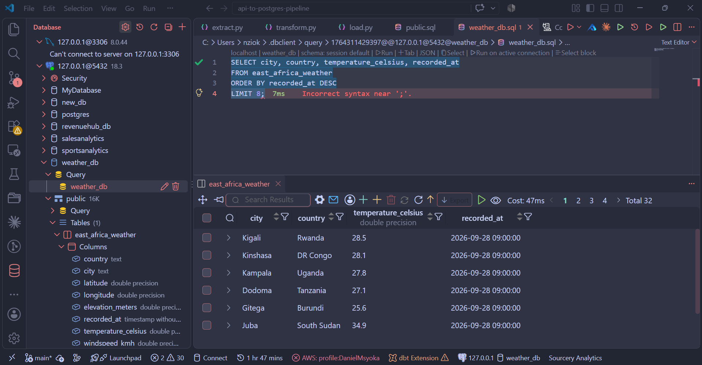

# East Africa Weather: Real-Time API-to-PostgreSQL ETL Pipeline


A modular, production-style data engineering pipeline built in Python. It extracts real-time meteorological observations for 8 East and Central African capital cities (Kenya, Uganda, Tanzania, Rwanda, Burundi, South Sudan, DR Congo and Somalia) from the [Open-Meteo](https://open-meteo.com/) REST API, flattens and normalizes the nested JSON with Pandas, enforces a strict analytical schema, and loads the result into a PostgreSQL database using SQLAlchemy.

---

## 🏗️ Technical Architecture

```text
  +-----------------------+
  |  Open-Meteo REST API  |
  +-----------+-----------+
              |
              |  [Phase 1: Extraction - Requests]
              v
  +-----------------------+
  |    src/extract.py     | --> Batch pulls weather payloads for 8 EA capitals
  +-----------+-----------+
              |
              |  [Phase 2: Transformation - Pandas]
              v
  +-----------------------+
  |   src/transform.py    | --> Flattens JSON, parses ISO dates, enforces types
  +-----------+-----------+
              |
              |  [Phase 3: Load - SQLAlchemy + psycopg2]
              v
  +-----------------------+
  |  PostgreSQL Database  | --> Target table: 'east_africa_weather'
  +-----------------------+
```

---

## 🛠️ Tech Stack & Key Tools

| Category | Tools |
|---|---|
| Language | Python 3.10+ |
| Data manipulation & cleaning | Pandas |
| Database & ORM | PostgreSQL, SQLAlchemy, psycopg2-binary |
| API ingestion | Requests |
| Environment security | python-dotenv |
| Version control | Git, GitHub |

---

## 🚀 Key Data Engineering Capabilities

- **Batch ingestion:** extracts observations for all 8 capitals in a single execution loop.
- **Schema enforcement & type safety:** converts string timestamps into native Pandas `datetime64` objects and forces explicit numeric and boolean types before loading, protecting data integrity.
- **Nested JSON flattening:** unpacks multi-level API responses into a normalized, tabular format.
- **Modular design:** each ETL phase lives in its own module (`src/extract.py`, `src/transform.py`, `src/load.py`) and is coordinated by a central orchestrator (`main.py`).
- **Fault tolerance & safety:** explicit error handling for network requests, plus empty-payload guard clauses so bad or missing data never reaches the database.
- **Secure configuration:** credentials and endpoints are kept out of the codebase in a `.env` file.

---

## 📁 Project Structure

```text
api-to-postgres-pipeline/
├── src/
│   ├── extract.py       # API extraction (Requests)
│   ├── transform.py     # Cleaning, flattening, type enforcement (Pandas)
│   └── load.py          # Database load (SQLAlchemy + psycopg2)
├── main.py              # Pipeline orchestrator / entry point
├── requirements.txt     # Python dependencies
├── .env                 # Local environment variables (not committed)
└── README.md
```

---

## 💻 Sample Pipeline Execution Log

```text
============================================================
STARTING EAST AFRICA WEATHER ETL PIPELINE
============================================================

[PHASE 1/3] Extracting raw weather data...
[INFO] Extracting weather data for Nairobi, Kenya...
[INFO] Extracting weather data for Kampala, Uganda...
[INFO] Extracting weather data for Dodoma, Tanzania...
[INFO] Extracting weather data for Kigali, Rwanda...
[INFO] Extracting weather data for Gitega, Burundi...
[INFO] Extracting weather data for Juba, South Sudan...
[INFO] Extracting weather data for Kinshasa, DR Congo...
[INFO] Extracting weather data for Mogadishu, Somalia...

[PHASE 2/3] Transforming and normalizing dataset...

[PHASE 3/3] Loading data into PostgreSQL...
[INFO] Successfully loaded 8 rows into table 'east_africa_weather'.

============================================================
  PIPELINE EXECUTION COMPLETE (Duration: 13.01s)
============================================================
```

---

## 🔄 Transformation Example: Raw API Response to Table Row

**Phase 1: raw JSON returned by Open-Meteo (Nairobi, illustrative values):**

```json
{
  "latitude": -1.25,
  "longitude": 36.875,
  "elevation": 1662.0,
  "timezone": "GMT",
  "current_weather": {
    "time": "2026-09-28T10:00",
    "temperature": 22.4,
    "windspeed": 11.2,
    "winddirection": 90,
    "is_day": 1,
    "weathercode": 3
  }
}
```

**Phase 2: flattened and type-enforced row loaded into PostgreSQL:**

| country | city | latitude | longitude | elevation_meters | recorded_at | temperature_celsius | windspeed_kmh | wind_direction_degrees | is_day | weather_code |
|---|---|---|---|---|---|---|---|---|---|---|
| Kenya | Nairobi | -1.25 | 36.875 | 1662.0 | 2026-09-28 10:00:00 | 22.4 | 11.2 | 90 | True | 3 |

What changed: the nested `current_weather` object is flattened, the ISO-8601 string becomes a native timestamp, `is_day` (`1`/`0`) becomes a boolean, fields are renamed to explicit, unit-bearing column names, and `country` and `city` are attached from the pipeline's city configuration.

---

## 📋 Target Database Schema (`east_africa_weather`)

| Column Name | Data Type | Description |
|---|---|---|
| `country` | VARCHAR / STRING | Country name |
| `city` | VARCHAR / STRING | Capital city name |
| `latitude` | FLOAT | City latitude coordinate |
| `longitude` | FLOAT | City longitude coordinate |
| `elevation_meters` | FLOAT | Elevation above sea level in meters |
| `recorded_at` | TIMESTAMP | Observation timestamp (ISO-8601 converted) |
| `temperature_celsius` | FLOAT | Temperature (°C) |
| `windspeed_kmh` | FLOAT | Wind speed (km/h) |
| `wind_direction_degrees` | INTEGER | Wind direction in degrees |
| `is_day` | BOOLEAN | Daytime indicator (True/False) |
| `weather_code` | INTEGER | WMO Weather Interpretation Code, a standard numeric code for conditions such as clear sky, rain or thunderstorm ([Open-Meteo Reference](https://open-meteo.com/en/docs)) |

---

## ⚡ Local Setup & Execution Guide

### 1. Clone the repository and set up a virtual environment

```bash
git clone https://github.com/DanielNzioki/api-to-postgres-pipeline.git
cd api-to-postgres-pipeline

# Create virtual environment
python -m venv .venv

# Activate virtual environment (Windows Git Bash)
source .venv/Scripts/activate

# Or on macOS / Linux / WSL
# source .venv/bin/activate
```

### 2. Install dependencies

```bash
pip install -r requirements.txt
```

### 3. Configure environment variables

Create a `.env` file in the project root:

```env
API_BASE_URL="https://api.open-meteo.com/v1/forecast"
DB_USER="postgres"
DB_PASSWORD="your_postgres_password"
DB_HOST="localhost"
DB_PORT="5432"
DB_NAME="weather_db"
```

> ⚠️ Never commit your `.env` file. Make sure it is listed in `.gitignore`.

### 4. Create the target database and run the pipeline

Make sure your local PostgreSQL server is running, then create the destination database:

```sql
CREATE DATABASE weather_db;
```

Run the full pipeline through the orchestrator:

```bash
python main.py
```

### 5. Verify the load

```sql
SELECT city, country, temperature_celsius, recorded_at
FROM east_africa_weather
ORDER BY recorded_at DESC
LIMIT 8;
```

Expected output in your SQL client:



---

## 🔮 Possible Enhancements

- Schedule recurring runs (cron, Task Scheduler or Apache Airflow)
- Add retry logic with exponential backoff for API calls
- Switch to upsert logic to avoid duplicate observations
- Add unit tests for the transform layer
- Containerize with Docker

---

## 📄 License

This project is licensed under the MIT License. See the `LICENSE` file for details.